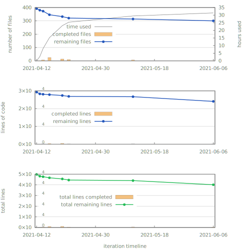

# MagMechFEM_Matlab2Julia

---

| **Documentation**    | [TODO]                                           |
|----------------------|--------------------------------------------------|
| **Docs Dev**         | [![docs dev][docs-dev-img]][docs-dev-url]        |
| **Licence**          | [TODO]                                           |

[docs-dev-img]: https://img.shields.io/badge/docs-dev-blue.svg
[docs-dev-url]: https://lazyscholar.github.io/MagMechFEM_Matlab2Julia/dev

---

## Description

This project aims to port a FEM research code to Julia. I worked on that specific code as part of my diploma thesis.
The FEM code is written in Matlab (with some bits in C) and belongs to the [IFKM (Institute of Solid Mechanics)][ifkm-url] at [TUD (Technische Universität Dresden)][tud-url].
I got the permission to create a Julia port with the exceptions of some parts of the code which i will not upload into this repository (mainly material models/routines).

## Publications

The code is build upon or with the following primary publications which should be cited if you use or build upon this code:

The overview of further sources can be accessed at:

## Licence

The main parts of this ported code are licensed under ... [TODO]
For further information see the `LICENSE` files within the module directories.

## Motivation

The main motivations for this project are:

- I want to see if Julia is truly faster than Matlab on a something else than benchmark codes.
- I want to deepen my overview and insight on the interconnections on a comparable small FEM code (i tried it with a ten times bigger code and failed).
- In the process of this project i want to build a tool set with Julia as i can not afford a Matlab licence after leaving my university.
- Furthermore, i want to get a feeling on how much time and effort is necessary to make a language port of a bigger code base.

I decided to do this project after looking into Julia and its possibilities.
I searched for a ecosystem similar to Matlab where the prototyping could be done easily.
The main selling points of Matlab i.m.o. are the integrated plotting, the high level functions and the IDE functionality allowing the exploration of the variables.
Julia does provide all that except for the IDE functionality. But it is free and claims to be faster than Matlab or Python (according to their information).

## Road map

The planed road map for this project is:

- [ ] find a suitable licence (Apache 2.0 or MIT)
  - [Which License Should I Use? MIT vs. Apache vs. GPL](https://exygy.com/blog/which-license-should-i-use-mit-vs-apache-vs-gpl/)
  - [Apache license 2.0, MIT license or BSD license](https://snyk.io/blog/mit-apache-bsd-fairest-of-them-all/)
  - [TLDR Apache License 2.0](https://tldrlegal.com/license/apache-license-2.0-(apache-2.0))
  - [TLDR MIT License](https://tldrlegal.com/license/mit-license)
  - [ ] add `LICENSE` file and if necessary ad license headers to each file or at least each module
  - [ ] add a `NOTICE.md` file for the license notes for the used third party code or add that to the `LICENSE` file
- [ ] ad a `CONTRIBUTING.md` file in order to establish contributing rules and the terms of contributing
- [ ] research Julia coding styles and workflows
  - add those to `CONTRIBUTING.md`
- [ ] port the code file by file
  - do only the port do not use any Julia specific language features and do no premature optimization
  - while porting the code try to set up as many unit tests while comparing the results to the Matlab version (the unit tests will be handy later on)
  - for now use no specific data types (use `<:Integer` and `<:AbstractFloat`)
  - try to add a extensive function description to each ported function and its arguments
  - keep track on any special licences of third party code and keep track of the corresponding publications
  - add publications which should be cited if using this code base
- [ ] after porting make some performance examinations and use Julia specific language features to improve the performance with minor modifications
- [ ] make some final performance studies in order to come to a conclusion if any language might be better for this case
- [ ] add a `CHANGELOG.md` file at the end to keep track of further changes after the porting has been done

This are the points i want to accomplish on this specific project.

## Progress

The upper graph shows only the time used to translate the files not the debugging, testing or tinkering (besides the files).
So in order to estimate the real work time one could double or triple that used time.
The second graph shows furthermore only the lines of code which had been translated on the respective iteration.
As the translation also involves the translation of the documentation it is more reasonable to take the total lines ported into account (third graph).

## Outlook

I might try to refactor the resulting code later on.
Or might as well rewrite the whole FEM code in order to get a slim and efficient code while not striping off any major features.
I doubt that i will maintain the ported code in its final form as my final goal is a code base that is highly extensible and easy to grasp.
Less like a research code and more like a teaching code with a good documentation as a slim base which one can learn in a short time, come back to and build upon later.
But that is a project on its own.
And i will not continue it here as those modifications might change the form of the code too much.
Provided that i want to continue with that vision after this project.

[ifkm-url]: https://tu-dresden.de/ing/maschinenwesen/ifkm?set_language=en
[tud-url]: https://tu-dresden.de/#